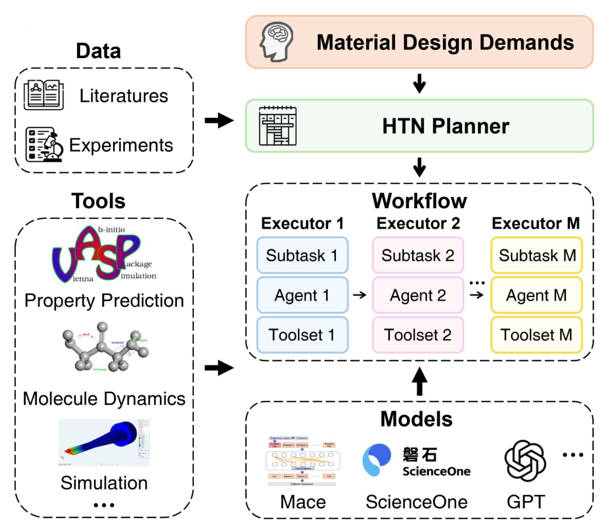

<div align="center">

## <p align="center">S1-MatAgent: A planner driven multi-agent system for material discovery</p>

---
</div>

<div align="center">

[](https://github.com/ScienceOne-AI/S1-MatAgent)
[](https://opensource.org/licenses/Apache-2.0)
<br />


<br />

A Planner driven Multi Agent System for Material Discovery
    <br>
    <br>
🔗 <a href="https://glensjh.github.io/S1-MatAgent">Homepage</a> | 📑 <a href="https://arxiv.org/abs/2509.14542">Paper</a>
  </p>

</div>

## 🌟Introduction
**S1-MatAgent** is a planner-driven multi-agent system (MAS) that overcomes the limitations of predefined, inflexible MAS for materials discovery. 
Its automated **Planner-Executor** architecture dynamically decomposes complex design tasks and configures specialized tools, drastically reducing manual effort.

We demonstrated its power by autonomously completing the full-cycle inverse design of high-entropy alloy catalysts for the hydrogen evolution reaction. 
To bridge the design-to-target gap, a novel gradient-based optimization algorithm was employed, achieving a **27.7%** performance improvement.

From 20 million candidates, S1-MatAgent designed 13 high-performance catalysts, with **Ni₄Co₄Cu₁Mo₃Ru₄** exhibiting an exceptional overpotential of **18.6 mV** and outstanding durability. 
This work provides a universal and scalable framework for autonomous material discovery.

<div align=center>   </div>

## 🔧Prepare

### 📦 Build an environment for MACE server
```
conda create -n server python=3.10
conda activate server
pip install mace-torch==0.3.13
# you may need to adjust the torch version according to your device
pip install ase
```

### 📦 Build an environment for S1-MatAgent
```
conda create -n matagent python=3.11
conda activate matagent
pip install -r requirements.txt
```

### ⚙️ Configure API

Open the `.env` file in your preferred text editor and insert your API keys in the corresponding fields.

## 🚀 Quick Start

### 1. Start MACE server
```
conda activate server
python model/mace_server.py
```
The MACE server needs to be kept running when using S1-MatAgent. It use a fine-tuned MACE model on HEAs `mace_finetuned.model` and a general one `mace_agnesi_medium.model` (you need to [download it from mace-foundations](https://github.com/ACEsuit/mace-foundations/releases/download/mace_mp_0b/mace_agnesi_medium.model), and place it under the model directory).

### 2.1 Run in browser
```
conda activate matagent
chainlit run app.py -w --host [your host] --port [your port] #e.g. chainlit run app.py -w --host 0.0.0.0 --port 8501
# Then open the browser
```
Three sample tasks of S1-MatAgent are predefined below the input bar: "**Material Q&A**", "**Material Calculation**", "**Material Design**". Click to execute.
When performing "**Material Design**" task, you need to upload a "**literatures.csv**" file. The file contains relevant literature information on high entropy alloy catalysts for hydrogen evolution reaction under alkaline conditions, and should contain at least the columns **title**, **date**, **authors**, **abstract** and **publications**
S1-MatAgent has good extensibility and can define other tools to enable it to perform more tasks.

### 2.2 Run in Terminal
```
conda activate matagent
python run.py "your task"
# python run.py "Summarize the latest application of alloy materials in the catalytic field"
# python run.py "Calculate the energy of Ni(HO)2, and demonstrate its structure"
# python run.py "Design highly active high entropy alloy (HEA) catalysts for hydrogen evolution reaction (HER) in an alkaline environment based on the literature file (path='your file path')"
```

---
## 🤝 Acknowledgements
- ASE: [https://ase-lib.org/](https://ase-lib.org/)
- CAMEL-AI: [https://www.camel-ai.org/](https://www.camel-ai.org/)
- MACE: [https://github.com/ACEsuit/mace](https://github.com/ACEsuit/mace)
- Materials Project: [https://next-gen.materialsproject.org/](https://next-gen.materialsproject.org/)
- Chainlit: [https://docs.chainlit.io/get-started/overview](https://docs.chainlit.io/get-started/overview)
- VESTA: [https://www.jp-minerals.org/vesta/en/download.html](https://www.jp-minerals.org/vesta/en/download.html)

## 🔍 License
This project is licensed under the Apache-2.0 License.

## 🚩Citation

If you find our repository useful in your research, please kindly consider cite:
```bibtex

@article{
      title={S1-MatAgent: A planner driven multi-agent system for material discovery}, 
      author={Xinrui Wang, Chengbo Li, Boxuan Zhang, Jiahui Shi, Nian Ran, Linjing Li, Jianjun Liu, Dajun Zeng},
      year={2025},
      eprint={2509.14542},
      archivePrefix={arXiv},
      url={https://arxiv.org/abs/2509.14542}, 
}
```
